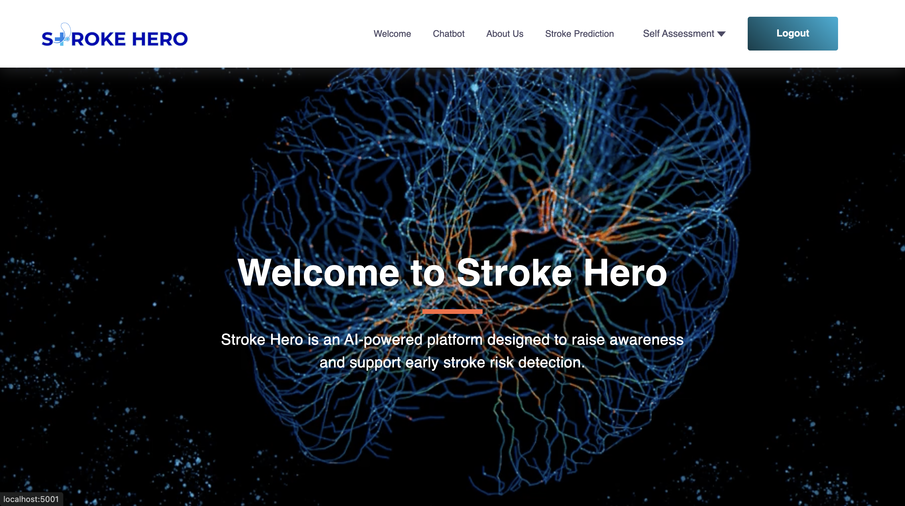
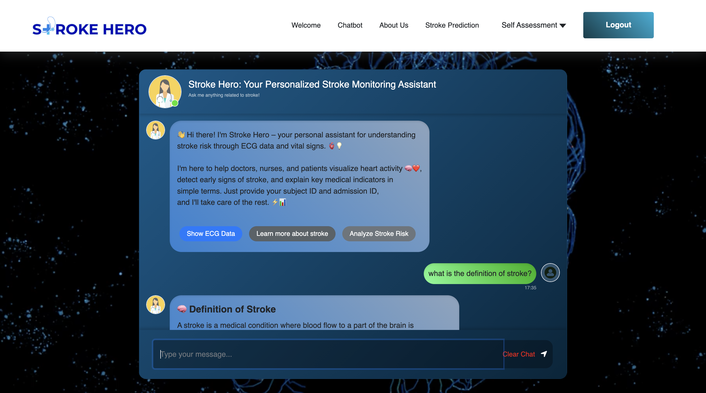
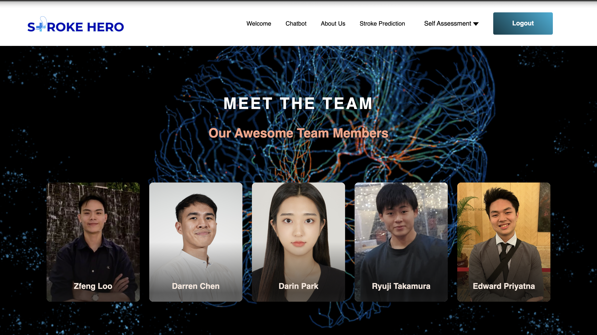
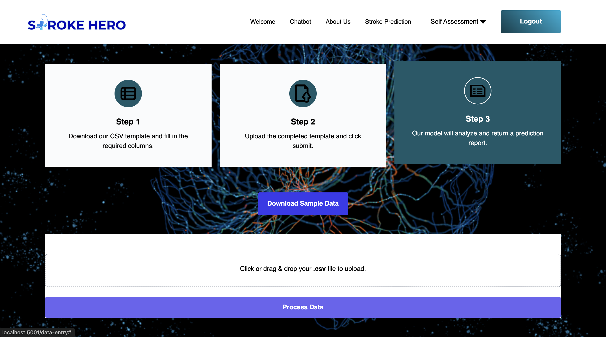
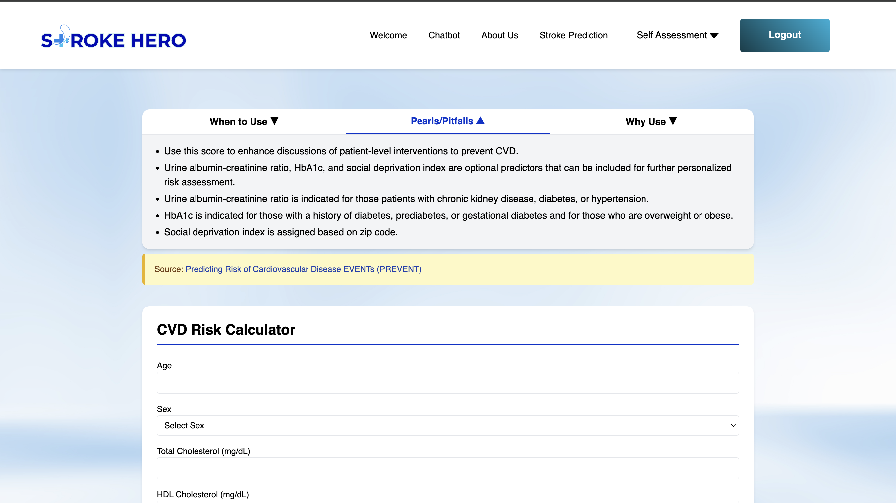
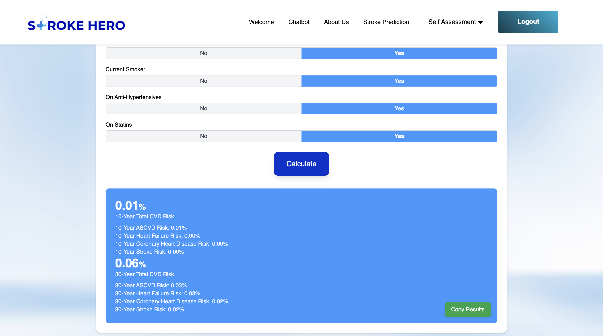
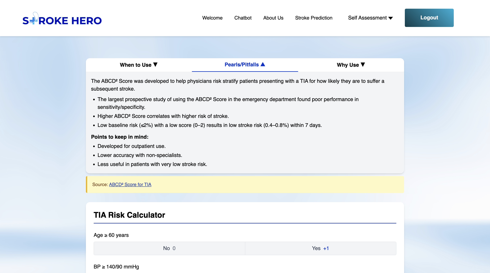
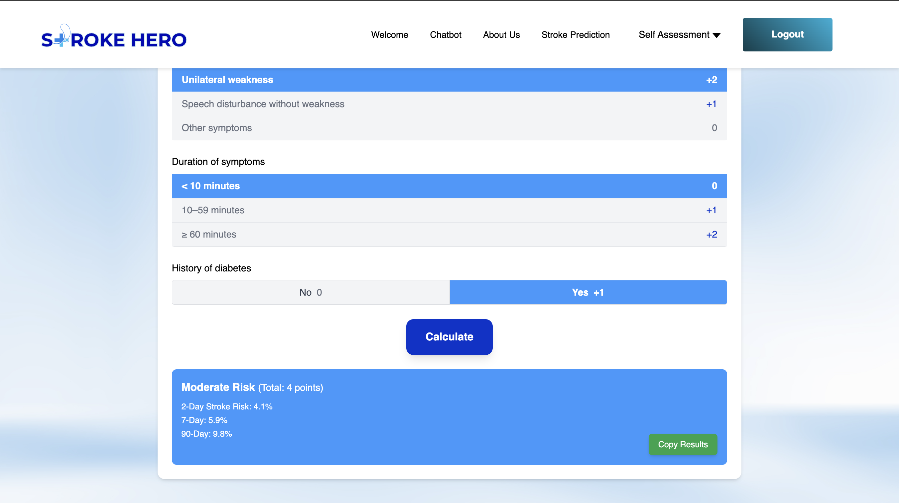
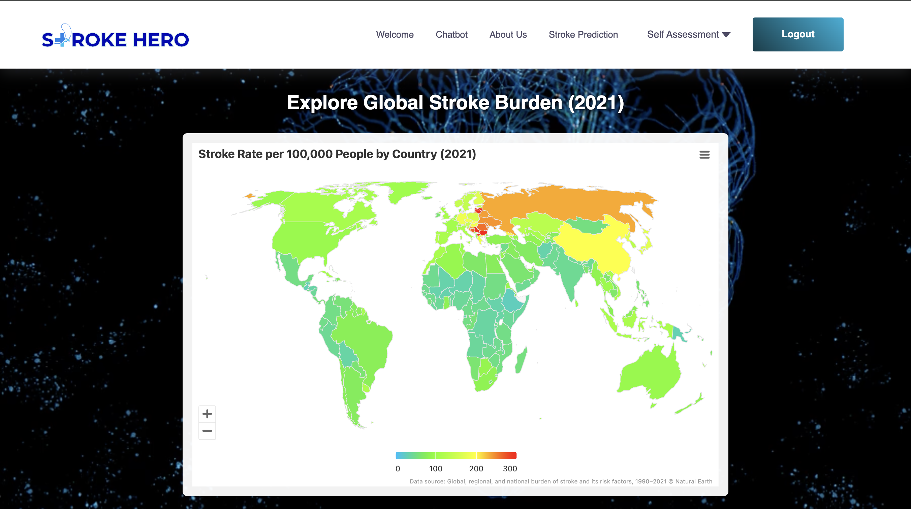
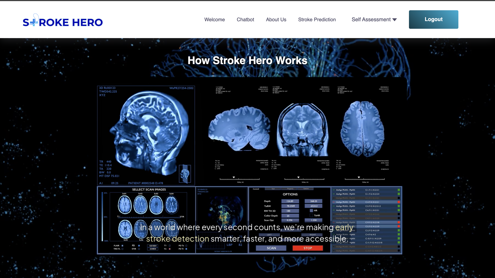

# Stroke Hero: Interpretable Stroke Monitoring System

This project is a comprehensive system for stroke risk prediction, combining data engineering, machine learning, and web application components. The system processes medical data, particularly ECG signals, to predict stroke risk using advanced deep learning models.

Download the [MIMIC-IV-ECG dataset](https://physionet.org/content/mimic-iv-ecg/1.0/) and the [MIMIC-IV dataset](https://physionet.org/content/mimiciv/2.2/) (with credentialed access).

---

## Project Structure

- `app/`: Main application package containing web interface and core functionality  
- `data_engineering/`: Data processing and preparation pipelines  
- `data_science/`: Machine learning and deep learning model development  
  - `ECG_deep_learning/`: ECG signal processing and deep learning models  
  - `VS_machine_learning/`: Vital signs machine learning models  
- `model_inferencing/`: Model deployment and inference code  
- `web_app/`: Web application frontend  
- `stroke_agent/`: AI agent for stroke risk assessment  
- `uploads/`: Temporary storage for uploaded files  

---

## Setup and Installation

1. Install dependencies:
```bash
pip install -r requirements.txt
````

2. Run the application:

```bash
python server.py
```

---

## Docker Support

The application can be run using Docker:

```bash
docker-compose up
```

---

## Key Features

* ECG signal processing and analysis
* Deep learning-based stroke risk prediction
* Web interface for data upload and results visualization
* Real-time inference capabilities
* Docker containerization for easy deployment

---

## Environment

* Python 3.9+
* Recommended: Linux or macOS
* Minimum 16GB RAM for training deep learning models

---

## Evaluation Metrics

* Accuracy, Precision, Recall, F1-score
* ROC-AUC for binary stroke risk classification
* SHAP values and saliency maps for interpretability

---

## Model Pipeline Overview

* ECG signals are preprocessed using filtering, segmentation, and normalization.
* Deep learning models (e.g., LSTM or 1D CNN) are trained to classify patterns indicative of stroke risk.
* A separate machine learning pipeline is used for vital signs and demographic features.
* Final stroke risk prediction is computed via ensemble or decision logic based on both pipelines.

---

## Data Access & Ethics

This project uses data from the MIMIC-IV and MIMIC-IV-ECG databases, which require credentialed access via PhysioNet. Please ensure that your use complies with all relevant privacy, ethical, and licensing requirements.

---

## 🔍 Live Preview

### 🔵 Welcome Page


### 🤖 Chatbot Assistant


### 👥 Meet the Team


### 📤 Upload & Predict Stroke Risk


### 🧠 CVD Risk Calculator


### 📊 CVD Risk Results


### 🧮 ABCD² Stroke Score Calculator


### 🧮 ABCD² Stroke Score Results


### 🌍 Global Stroke Burden Explorer


### 🧬 How Stroke Hero Works


---

## Citation

If you use this project or dataset in your research, please cite:

```bibtex
@article{strodthoff2024prospects,
  title={Prospects for artificial intelligence-enhanced electrocardiogram as a unified screening tool for cardiac and non-cardiac conditions: an explorative study in emergency care},
  author={Strodthoff, Nils and Lopez Alcaraz, Juan Miguel and Haverkamp, Wilhelm},
  journal={European Heart Journal-Digital Health},
  pages={ztae039},
  year={2024},
  publisher={Oxford University Press UK}
}
```

---

## Contributors

* Loo Zfeng (MLOps Engineer, LLM Engineer)
* Ryuji Takamura (Data Scientist, AI Engineer)
* Darin Park (Data Scientist, AI Engineer)
* Darren Chen (Project Manager, Front-end Developer)
* Edward Priyatna (Full Stack Developer, Solution Architect)

---

## Contact

For issues or inquiries, please contact \[[loozfeng2704@gmail.com](mailto:loozfeng2704@gmail.com)].

